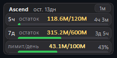
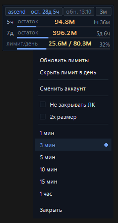
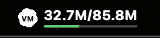
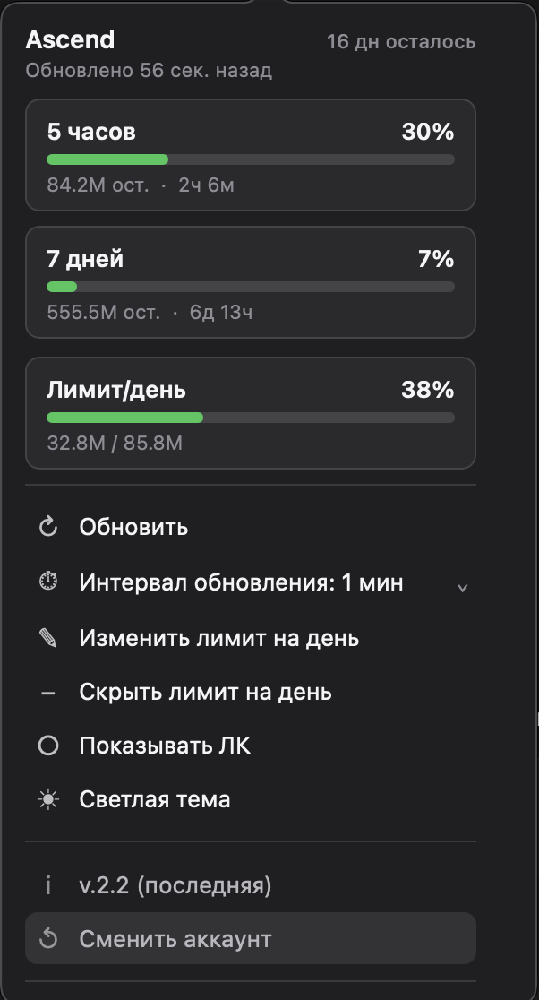

# Vibemode Overlay 2.9

Компактный desktop-overlay для лимитов Vibemode API. Работает локально на **Windows** и **macOS**, читает данные из кабинета Vibemode через локальную браузерную сессию Chrome/Playwright и показывает остатки, прогресс и время до сброса лимитов.

## Что показывает

- тариф и время до окончания подписки;
- остатки и прогресс по окнам **5 часов** и **7 дней**;
- реальное время до сброса окон лимитов из Vibemode API;
- дневной лимит расхода, если он задан вручную;
- время последнего обновления и меню действий.

## Скриншоты

<table>
  <tr>
    <td></td>
    <td></td>
  </tr>
  <tr>
    <td align="center">Windows overlay</td>
    <td align="center">Windows menu</td>
  </tr>
  <tr>
    <td></td>
    <td></td>
  </tr>
  <tr>
    <td align="center">macOS menu bar</td>
    <td align="center">macOS popover</td>
  </tr>
</table>

## Что нового в 2.9

- macOS: исправлено повторное открытие страницы входа после сна.
- macOS: устранены аварийные проверки неиспользуемого Tk-интерфейса.

## Установка

### Windows: из Git

```powershell
git clone https://github.com/RyandavisProject/vibemode.git
cd vibemode
powershell -ExecutionPolicy Bypass -File .\scripts\install.ps1
```

### Windows: из ZIP-архива

1. Открой [Releases](https://github.com/RyandavisProject/vibemode/releases).
2. Скачай `vibemode-v2.9.zip` из последнего релиза.
3. Распакуй архив, например в `C:\Vibemode`.
4. Запусти:

```powershell
powershell -ExecutionPolicy Bypass -File .\scripts\install.ps1
```

Запуск:

```powershell
powershell -ExecutionPolicy Bypass -File .\scripts\run-overlay.ps1
```

### macOS: из Git

```bash
git clone https://github.com/RyandavisProject/vibemode.git
cd vibemode
bash scripts/install.sh
```

Установка создаёт `Vibemode.app` на рабочем столе и в Applications.

### macOS: из ZIP-архива

1. Открой [Releases](https://github.com/RyandavisProject/vibemode/releases).
2. Скачай `vibemode-v2.9.zip` из последнего релиза.
3. Распакуй архив и в папке проекта запусти:

```bash
bash scripts/install.sh
```

После установки на рабочем столе появится `Vibemode.app`.

Запуск:

```bash
bash scripts/run-overlay.sh
```

## Первый вход

1. Overlay открывает локальный профиль Chrome/Playwright.
2. Если Vibemode просит вход, появится отдельное окно браузера.
3. Войди обычным способом на сайте Vibemode.
4. После успешного входа окно браузера скрывается, а overlay продолжает читать данные из той же локальной сессии.

## Приватность

- Overlay работает локально и не отправляет твои лимиты, cookies или данные аккаунта в стороннюю аналитику.
- Пароль Vibemode не вводится в интерфейс overlay.
- Cookies и сессия остаются в локальной папке:

```text
~/.neurogate-usage-overlay/browser-profile
~/.neurogate-usage-overlay/overlay-state.json
~/.neurogate-usage-overlay/usage-daily.json
```

Эту папку нельзя публиковать или передавать другим людям: там может быть твоя браузерная сессия.

## Управление

- Клик по overlay/menu bar открывает меню действий.
- `Обновить` — принудительно перечитать лимиты.
- `Лимит на день` — вручную задать дневной расход.
- `Сменить аккаунт` — сбросить локальный профиль overlay и открыть чистый вход.
- `Интервал` — переключить частоту обновления.

## Разработка и проверки

```powershell
powershell -ExecutionPolicy Bypass -File .\scripts\check.ps1
python -m unittest tests.test_browser_reader tests.test_overlay -v
python -m neurogate_usage_overlay --once
```

Диагностика доступных endpoint'ов Vibemode API:

```powershell
python scripts\check-api-contract.py
```

API-ключ, если используется для диагностики, вводится скрыто или через переменную окружения и не сохраняется проектом.

## История

### 2.9 — 12-07-2026

- macOS: исправлено повторное открытие страницы входа после сна.
- macOS: устранены аварийные проверки неиспользуемого Tk-интерфейса.

### 2.8 — 09-07-2026

- macOS: исправлен запуск через `Vibemode.app` и обновление runtime.
- macOS: убран пункт `Показывать ЛК` / `Закрывать ЛК`.
- macOS: исправлен ввод лимита на день в popover.
- Проверено: тесты затронутых модулей, `compileall`, live macOS-запуск.

### 2.7 — 08-07-2026

- macOS overlay восстанавливает browser context после сна без удаления локальной сессии.
- Windows overlay после сна пересоздаёт hidden Playwright context даже при валидном, но замороженном dashboard.
- Forced recovery больше не принимает stale dashboard как свежие лимиты.
- Добавлена безопасная диагностика `scripts/diagnose-resume.ps1` для проверки repeated snapshot-ов после resume.
- Ограничен рост `restart.log` и `launcher.log`.
- Добавлена безопасная чистка Chrome cache/metrics без удаления cookies/local/session storage.
- Убран шумный `BrokenPipeError` из popover server при закрытом локальном клиенте.
- Проверено: `scripts/check.ps1`, live Windows sleep/resume, live macOS-запуск с чтением лимитов.

### 2.6 — 04-07-2026

- macOS installer теперь создаёт `Vibemode.command` на рабочем столе.
- Desktop-ярлык запускает overlay в режиме без перезапуска уже работающей копии.
- Убрано лишнее hidden recovery на первом login prompt, чтобы ЛК не открывался повторно.
- Windows/macOS sleep/wake recovery переведён на нативные события питания и общий coordinator.
- Overlay удерживает последний хороший snapshot, если после сна пришли неполные или низкодостоверные данные.
- Исправлен дневной расход: расширение 7-дневного окна больше не показывает `0` потраченных токенов.

### 2.5 — 03-07-2026

- macOS menu bar/popover проверен на рабочем запуске после последних правок.
- Исправлена ширина macOS popover: контент занимает всё окно, отступы слева и справа одинаковые.
- Подтверждено чтение лимитов и времени сброса через Vibemode API.

### 2.4 — 30-06-2026

- Прозрачные округлённые углы Windows overlay.
- Восстановление чтения лимитов после сна без удаления browser profile.
- Реальное время сброса окон из `/client/me`.
- Честная подсказка дневного лимита: без реального reset time значение не предлагается.
- Atomic JSON state/history, hardening popover server, расширенные тесты.

### 2.3 — 27-06-2026

- Windows overlay визуально приближен к macOS-попапу.
- Обновлены меню, tooltip, окно дневного лимита и верхние Windows-скриншоты.
- Добавлена безопасная диагностика API contract.

### 2.2 — 27-06-2026

- Улучшены macOS menu bar/popover, дневной лимит, update scripts и GitHub checks.

Полная история изменений: [CHANGELOG.md](CHANGELOG.md).
